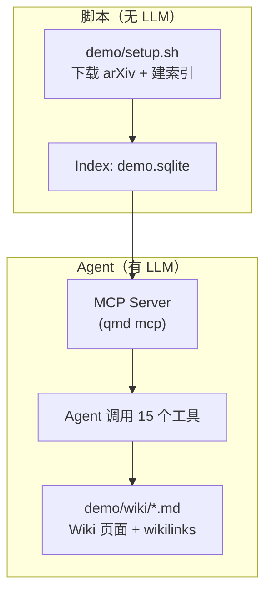

## MinerU Document Explorer Demo 实操课（30–45 分钟）

这份材料的目标是让你 **亲手跑通一次 demo**，获得“Agent 真的会读文档/写知识库”的体验感，而不是只看概念介绍。

### 课程产出（你跑完会看到什么）

- `demo/papers/`：下载的论文 PDF + `metadata.json`
- `~/.cache/qmd/demo.sqlite`：名为 `demo` 的索引数据库（BM25 必有；embedding 视你是否生成）
- `demo/wiki/`：Agent 写出来的 Wiki（概念页/论文页/综述/索引）
- 三张参考效果图（Demo 产物示意）：


---

### 一张图理解 Demo 的分工



核心原则：**脚本只做非智能工作（抓取与建索引）**；Wiki 的结构、内容、交叉引用全部交给 Agent 通过工具自主完成。

---

### 0）课前/开跑前准备（5 分钟）

#### 依赖检查

```bash
python3 --version   # 需要 >= 3.10
bun --version
```

#### Python 依赖（PDF 下载与解析必需）

```bash
pip install feedparser pymupdf
python3 -c "import feedparser; import pymupdf; print('OK')"
```

> 说明：Demo 的论文是 PDF，默认用 PyMuPDF 做本地解析；如你希望更高质量解析（扫描件/复杂表格），可选启用 MinerU Cloud（见下文“高质量模式”）。

#### 安装仓库依赖

在仓库根目录执行：

```bash
bun install
```

---

### 1）跑 Demo setup（10–20 分钟）

`demo/setup.sh` 是 Demo 唯一脚本步骤：**抓论文 + 建索引（可选 embedding）**。

#### 课堂推荐：轻量模式（更快）

只抓 3 篇论文、跳过 embedding（避免首次下载大模型，适合课堂现场）：

```bash
bash demo/setup.sh --max 3 --skip-embed
```

#### 完整模式：10 篇论文 + embedding（效果最好）

```bash
bash demo/setup.sh --max 10
```

#### 高质量模式：启用 MinerU Cloud 解析 PDF（推荐真实业务场景）

```bash
pip install mineru-open-sdk
export MINERU_API_KEY="your-key-here"
MINERU_API_KEY="$MINERU_API_KEY" bash demo/setup.sh --max 10
```

---

### 2）把 Agent 接上 MCP（优先：Claude Code，2–3 分钟）

#### Claude Code（stdio，优先推荐）

Claude Code 会自动启动并管理 MCP 子进程。最简单的方式是一条命令添加：

```bash
claude mcp add qmd -- bun src/cli/qmd.ts --index demo mcp
```

然后在 Claude Code 对话里先让 Agent 调一次 `status()` 验证连通。

---

### 3）（可选）把 Agent 接上 MCP（Cursor，HTTP，3 分钟）

如果你用 Cursor（或希望多客户端共享同一个服务），推荐 HTTP 模式：

1) 启动 MCP 服务器（HTTP 前台）：

```bash
bun src/cli/qmd.ts --index demo mcp --http
```

2) 健康检查：

```bash
curl http://localhost:8181/health
```

3) 在项目根目录创建（或编辑）`.cursor/mcp.json`：

```json
{
  "mcpServers": {
    "qmd": {
      "url": "http://localhost:8181/mcp"
    }
  }
}
```

然后在 Cursor 里确认 MCP 工具可用（能看到 `qmd` 相关工具，或让 Agent 先执行一次 `status()` 验证连通）。

---

### 4）让 Agent 开始工作（10–20 分钟）

把下面文件内容 **完整粘贴**给你的 Agent（作为 system prompt 或第一条指令均可）：

- [`AGENT-PROMPT-zh.md`](AGENT-PROMPT-zh.md)（中文版本，课堂推荐）
- [`AGENT-PROMPT.md`](AGENT-PROMPT.md)（英文版本，内容更“严格流程化”）

课堂最小目标（MVP）建议设为：

- 至少为 1–3 篇论文写 `demo/wiki/papers/*.md`
- 至少写 2 个概念页 `demo/wiki/concepts/*.md`
- 运行 `wiki_lint` + `wiki_index(write=true)` 生成 `demo/wiki/index.md`

---

### 5）验收与体验（5–10 分钟）

#### A. 看看索引是否正常

```bash
bun src/cli/qmd.ts --index demo status
```

你应该能看到：
- `sources` collection 有若干 PDF
- `wiki` collection 已存在（Agent 写完后会有文档数增长）

#### B. 搜一把（体验“wiki 写回后可检索”）

```bash
# 关键词（零模型）
bun src/cli/qmd.ts --index demo search "multi-hop"

# 混合检索（质量更好；可用 -C 降低重排候选加速）
bun src/cli/qmd.ts --index demo query -C 20 "multi-hop RAG evaluation"
```

#### C. 看看 `demo/wiki/` 的产物结构

期望出现类似结构（文件名会因 Agent 写法不同而变化）：

```text
demo/wiki/
├── papers/
│   ├── <paper-1>.md
│   └── <paper-2>.md
├── concepts/
│   ├── rag-fundamentals.md
│   └── evaluation-benchmarks.md
├── survey.md
└── index.md
```

---

### 6）可选加练：把 Demo 迁移到你的文档（10 分钟）

1) 把你的文档索引成一个新 collection（示例）：

```bash
# 如果你全局安装了 qmd：
qmd --index demo collection add ~/my-docs --name mydocs --mask '**/*.{md,pdf,docx,pptx}'
qmd --index demo context add qmd://mydocs "这是我自己的项目文档/规范/会议纪要"

# 或者直接从源码运行（不需要全局安装）：
bun src/cli/qmd.ts --index demo collection add ~/my-docs --name mydocs --mask '**/*.{md,pdf,docx,pptx}'
bun src/cli/qmd.ts --index demo context add qmd://mydocs "这是我自己的项目文档/规范/会议纪要"
```

2) 让 Agent 用同样的工作流回答你的问题，并把结论写入一个 wiki collection（可复用 Demo 的 `wiki`，或新建一个）。

---

### 7）常见问题（课堂现场最常见）

- **下载慢 / 模型下载卡住**
  - 课堂推荐用 `--max 3 --skip-embed` 先跑通体验闭环；embedding 与扩展模型可课后补齐。

- **8181 端口被占用**
  - 用 `--port` 换端口：

```bash
bun src/cli/qmd.ts --index demo mcp --http --port 8080
```

然后把 `.cursor/mcp.json` 里的 url 同步改成 `http://localhost:8080/mcp`。

- **PDF 解析失败**
  - 先确认：

```bash
python3 -c "import pymupdf; print('OK')"
```

- **`doc_elements` 相关能力说明**
  - 课堂 Demo 的重点是“检索 + 精读 + 写回 Wiki”；`doc_elements`（表格/图/公式抽取）对不同格式/配置有差异，详见 `docs/tutorial-zh.md` 的“能力边界”部分。

---

### 8）清理（可选）

```bash
rm -f ~/.cache/qmd/demo.sqlite
rm -rf demo/papers demo/wiki
```

