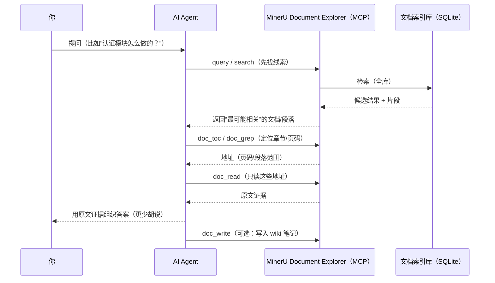
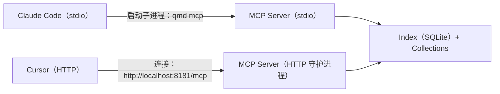

## MinerU Document Explorer 中文使用教程（图文版）

> 目标：把你的 Markdown / PDF / DOCX / PPTX 变成 **“可搜索、可精读、可持续写入的知识库”**，让 AI Agent 能像人一样 **先找、再读、再回答，并留下可追溯的知识产物**。

### 你会得到什么效果（来自 `demo/` 的真实产物）

运行 Demo 后，Agent 会把 10 篇论文整理成互相链接的 Wiki 知识库，并能继续在其上做检索与问答。

- **知识图谱（wikilinks 关系网）**


- **概念页（跨文档综合：定义、方法谱系、基准与对比）**


- **单文档摘要页（结构化总结 + 交叉引用）**


---

### 动手体验（推荐）：30–45 分钟跑通 Demo

如果你希望“有体验感”，最好的方式就是跟着跑一遍 `demo/`：脚本只负责抓取与建索引，Agent 会通过 MCP 工具自主阅读论文并写出 Wiki 页面。

- **实操课入口**：[`demo/WORKSHOP-zh.md`](../demo/WORKSHOP-zh.md)
- **中文 Agent Prompt**：[`demo/AGENT-PROMPT-zh.md`](../demo/AGENT-PROMPT-zh.md)
- **练习题与验收清单**：[`demo/EXERCISES-zh.md`](../demo/EXERCISES-zh.md)
- **讲师备忘（授课用）**：[`demo/INSTRUCTOR-zh.md`](../demo/INSTRUCTOR-zh.md)
- **完整 Demo 使用指南**：[`demo/README-zh.md`](../demo/README-zh.md)

最小化快跑（课堂推荐）：

```bash
bun install
pip install feedparser pymupdf
bash demo/setup.sh --max 3 --skip-embed
```

然后二选一（**优先 Claude Code**）：

- **Claude Code（stdio，优先推荐）**：

```bash
claude mcp add qmd -- bun src/cli/qmd.ts --index demo mcp
```

- **Cursor（HTTP，保留）**：

```bash
bun src/cli/qmd.ts --index demo mcp --http
```

### 这套系统解决什么问题

- **传统“把文档塞进 prompt”的问题**：长文档 token 成本高、上下文易丢、难以追溯，PDF/DOCX/PPTX 还要先手动转换。
- **传统“只做检索的 RAG”的问题**：只拿到片段，不会“翻目录/定位章节/精读细节”，更不会把阅读成果沉淀为可维护知识库。

MinerU Document Explorer 的定位是 **Agent 基础设施**：把“文档理解 + 搜索 + 精读 + 知识沉淀”做成一组稳定工具，并用 Skill 把最佳实践固化成可复用工作流。

---

### 小白先记住：你只需要会 4 个动作

把 MinerU Document Explorer 想成“给 AI 装一套 **会读文档的工具箱**”。你日常只需要记住下面 4 步（很多术语都可以先不管）：

```text
① 收进书架：把文件夹加入 collection（=一个资料库/书架）
② 先搜索：找到“可能相关”的文件/段落（像在资料库里搜关键线索）
③ 再精读：先看目录，再按页/段读取原文（像翻书，不会整本倒出来）
④ 写成笔记（可选）：把结论写进 wiki，越用越好用
```

下面这张图就是“你问 → Agent 找 → 精读证据 → 回答/写笔记”的完整闭环：



---

### 小白词典：这些词是什么意思（不懂也能用）

- **MinerU**：更像“文档 OCR + 版面理解器”。它能把复杂 PDF（扫描件/表格/公式/多栏排版）解析成更干净、更可用的结构化文本（常见是 Markdown）。
- **collection**：一组文档的“书架/资料库”。你把文件夹加进来，它就会被索引、可检索。
- **索引（index）**：类似“图书馆的检索卡”。建好后，你搜问题会很快，而且能搜到原文位置。
- **MCP**：把这些能力做成“Agent 可调用的工具接口”。Agent 不是瞎猜，而是会去 **调用工具**找证据。
- **wiki / `[[wikilinks]]`**：可以理解成“可维护的笔记本”。Agent 读完会把总结写进去，再用 `[[链接]]`把概念、资料互相连起来。

> 可选概念：**embedding（向量）**可以理解为“语义指纹”。开了以后更懂同义词/自然语言提问，但首次需要额外下载模型并生成向量。

---

### 我们是如何用 MinerU 做到“灵活问答 + Skill”的（通俗版）

我们把“会读文档的能力”拆成 3 件事，并都做成工具，让 Agent 可以稳定复用：

- **先把 PDF 变成可用文本（MinerU 加持）**
  - 默认用 PyMuPDF：安装简单、速度快。
  - 你设置 `MINERU_API_KEY` 后会优先用 MinerU Cloud：更适合扫描件/复杂表格/多栏排版，**证据质量更好**。

- **再让搜索更像“找证据”而不是“撞关键词”**
  - 你只要记住：`search` 更像“关键词搜索”；`query` 更像“更聪明的搜索（推荐）”。
  - 内部会做一些“召回 + 排序”的组合（你不需要懂算法细节），目标是把最像答案证据的段落排到前面。

- **最后让 Agent 像人一样翻文档**
  - 先 `doc_toc` 看目录/结构 → 再 `doc_read` 按页/段精读。
  - 这样可以强制避免“整篇倒进上下文”，更省 token，也更可控。

当你希望“不是只回答一次，而是越用越强”，就让 Agent 把结论写成 wiki 笔记：

- `doc_write` 写入 wiki（同时记录 `source` 可追溯）
- `wiki_lint` 定期检查断链/孤页/来源更新
- `wiki_index` 生成索引页，让知识库可浏览

<details>
<summary><b>进阶（可跳过）：QMD / LLM Wiki / BM25 / 向量这些到底是什么？</b></summary>

- **QMD**：MinerU Document Explorer 底层的本地索引与检索引擎（SQLite FTS + 向量检索 + 重排）。
- **LLM Wiki Pattern**：把“阅读后的知识”持续写回、持续链接、持续维护的一种模式（不是一次性答案）。
- **BM25 / 向量 / 重排序**：分别对应“关键词命中 / 语义相似 / 证据排序”。你不需要理解这些名词，只要知道 `query` 会把它们组合起来提升命中率与排序质量。

参考：
- [MinerU](https://github.com/opendatalab/MinerU)
- [QMD](https://github.com/tobi/qmd)
- [Karpathy LLM Wiki Pattern](https://gist.github.com/karpathy/442a6bf555914893e9891c11519de94f)

</details>

---

### 5 分钟上手：安装与准备

#### 运行环境

```bash
# Python（PDF/DOCX/PPTX 处理必需）
python3 --version  # 需要 >= 3.10

# Bun（开发/从源码运行时需要）
bun --version
```

#### 安装 Python 依赖（二进制文档处理）

```bash
pip install pymupdf python-docx python-pptx
python3 -c "import pymupdf; import docx; import pptx; print('OK')"
```

#### 安装 `qmd`（两种方式）

- **不知道选哪个？**
  - **只想直接用**（把它当工具）：选“方式 A”
  - **要跑本仓库的 Demo / 想二次开发**：选“方式 B”

> 本文后续示例默认你已经有 `qmd` 命令。  
> 如果你没有全局安装，也没关系：在仓库根目录把 `qmd ...` 替换成 `bun src/cli/qmd.ts ...` 也能跑通。

```bash
# 方式 A：全局安装（最省事）
npm install -g mineru-document-explorer

# 方式 B：从源码安装（适合二次开发）
git clone https://github.com/opendatalab/MinerU-Document-Explorer.git
cd MinerU-Document-Explorer
bun install
bun link
```

#### 可选：启用 MinerU Cloud（高质量 PDF 解析）

适用于扫描件、复杂排版、表格密集 PDF。

```bash
pip install mineru-open-sdk
export MINERU_API_KEY="your-key-here"  # 从 mineru.net 获取
```

设置 `MINERU_API_KEY` 后，系统会自动优先使用 MinerU Cloud 作为 PDF 解析引擎（并以 PyMuPDF 作为兜底）。

---

### 第一步：把文档加入知识库（Collection）

Collection 是“文档集合”，所有检索与精读都以 collection 为单位组织。

```bash
# 索引一个混合格式文件夹（推荐）
qmd collection add ~/my-docs --name docs --mask '**/*.{md,pdf,docx,pptx}'

# 查看索引状态（集合、文档数、是否需要 embedding）
qmd status
```

为了让检索更“懂你的语境”，建议补充 context（会跟随搜索结果返回给 Agent）：

```bash
qmd context add qmd://docs "项目设计文档、接口规范、会议纪要与周报"
qmd context list
```

#### 可选：创建一个可写入的 Wiki collection（用于沉淀知识）

原始文档通常放在 **raw collection**（只读），而 Agent 写出来的总结/结构化知识建议放在 **wiki collection**（可写、可维护、可追溯）。

```bash
mkdir -p ~/my-wiki
qmd collection add ~/my-wiki --name wiki --type wiki
qmd context add qmd://wiki "Wiki 知识库：由 Agent 编译生成的总结、概念页与索引页"
```

---

### 第二步：检索（从“找到文件”开始）

MinerU Document Explorer 有好几种“找东西”的方式。小白只要先记住两条就够了：

- **`qmd search`**：像在文档里“搜关键词”（最快、零模型、零门槛）。
- **`qmd query`**：像在资料库里“问问题”（更聪明、推荐）。第一次可能会下载/加载本地模型，之后会快很多。

`qmd vsearch` 是“纯语义搜索”，更偏进阶场景，一般不需要单独用（多数时候直接用 `qmd query` 就够了）。

#### 可选：生成向量嵌入（一次性）

如果你希望 `qmd query` / `doc_query` 更懂“同义表达 / 自然语言提问”，可以生成 embedding（一次性工作）：

```bash
qmd embed
```

首次运行会自动下载本地模型，时间取决于网络与文档量。

```bash
# 先用关键词搜索快速验证是否通
qmd search "认证 模块 架构"

# 需要更“聪明”的问答式搜索时用 query（首次可能下载模型）
qmd query "认证模块的整体架构是什么？有哪些关键组件与数据流？"
```

<details>
<summary><b>进阶（可跳过）：我想更精确地控制搜索（lex/vec/hyde）</b></summary>

当你发现“关键词太死板 / 语义太泛”，可以用结构化查询把意图拆开：

- `lex:` 更像“关键词 + 精确短语 + 排除词”
- `vec:` 更像“自然语言问题”
- `hyde:` 更像“你预期答案长什么样的一段话”

示例：

```bash
qmd query $'lex: "authentication" middleware -oauth\nvec: how does authentication work in this system'
```

</details>

---

### 第三步：精读（只读需要的段落，不整篇倾倒）

面对 PDF/DOCX/PPTX 或超长 Markdown，推荐固定套路：

1) `doc_toc` 先看结构  
2) 再用 `doc_read` 按地址读取关键章节  
3) 找细节用 `doc_grep`（关键词/正则）或 `doc_query`（语义，需 embedding）

```bash
# 看目录 / 结构
qmd doc-toc "docs/spec.pdf"

# 按地址精读（PDF 用 page，Markdown 用 line，DOCX 用 section，PPTX 用 slide）
qmd doc-read "docs/spec.pdf" "page:3-5"

# 文档内关键词定位
qmd doc-grep "docs/spec.pdf" "token|jwt|session"
```

**地址（address）是精读的关键抽象**：`doc_toc` / `doc_grep` / `doc_query` 会返回地址字符串，把这些地址直接喂给 `doc_read` 即可。

---

### 第四步：把 Agent 接进来（MCP 服务器）

MCP（[Model Context Protocol](https://modelcontextprotocol.io)）服务器把上述能力以 **15 个工具**暴露给 AI Agent（检索 / 精读 / 摄取三组），让 Agent 能“像调用函数一样读文档”。

#### 连接示意图（Claude Code 优先，Cursor 也支持）



#### Claude Code 配置（优先推荐：stdio 模式）

Claude Code 会自动启动并管理 `qmd mcp` 进程（无需你手动启动服务器）。推荐两种方式任选其一：

- **方式 A：一条命令添加（推荐）**

```bash
claude mcp add qmd -- qmd mcp
```

需要指定 index 时（例如 demo）：

```bash
claude mcp add qmd -- qmd --index demo mcp
```

- **方式 B：手动写配置**（`~/.claude/settings.json`）

```json
{
  "mcpServers": {
    "qmd": { "command": "qmd", "args": ["mcp"] }
  }
}
```

> 如果你是从源码运行（没有全局 `qmd`），可以把 `qmd ...` 替换为 `bun src/cli/qmd.ts ...`。

#### Claude Desktop（stdio，可选）

在 macOS 上编辑 `~/Library/Application Support/Claude/claude_desktop_config.json`：

```json
{
  "mcpServers": {
    "qmd": { "command": "qmd", "args": ["mcp"] }
  }
}
```

#### （可选）HTTP 守护进程（多客户端共享 / Cursor 推荐）

```bash
# 启动常驻服务（默认端口 8181）
qmd mcp --http --daemon

# 健康检查
curl http://localhost:8181/health

# 停止
qmd mcp stop
```

#### Cursor 配置（HTTP 模式，保留）

把下面内容写入项目级 `.cursor/mcp.json`（或全局 `~/.cursor/mcp.json`）：

```json
{
  "mcpServers": {
    "qmd": {
      "url": "http://localhost:8181/mcp"
    }
  }
}
```

---

### Skill：把“正确使用工具”的经验固化下来

工具解决“能做什么”，Skill 解决“怎么做得对、做得省 token、做得可追溯”。

仓库内置 Skill：`skills/mineru-document-explorer/SKILL.md`，它会教会 Agent：

- **只用 collection 相对路径**（例如 `docs/readme.md` 或 `#docid`），避免绝对路径。
- **大文档永远先 `doc_toc` 再 `doc_read`**，避免 `get` 倒出整篇文本。
- **用地址串联工具**：`doc_toc/doc_grep/doc_query` → 地址 → `doc_read`。
- **写 Wiki 必带 `source`**，用于可追溯与过期检测（`wiki_lint`）。
- **优先 MCP**：模型常驻内存/显存；CLI 每次调用都要重复加载模型，开销更大。

安装 Skill：

```bash
# 安装到当前项目（常见：让 Claude Code / Cursor 项目内直接可用）
qmd skill install

# 或安装到全局
qmd skill install --global
```

---

### 典型“灵活问答”工作流（Agent 会怎么做）

下面用“工程文档问答”举例说明 Agent 的工具链：

```text
用户：认证模块的架构是什么？请求从哪里进，token 在哪里校验？失败怎么处理？

Agent（典型策略）：
1) status          → 确认有哪些 collection、是否已有 embedding
2) query           → 找到最相关的规格/设计文档
3) doc_toc         → 找到 “Architecture / Auth / Token / Error handling” 对应章节地址
4) doc_read        → 精读这些章节（只读关键页/段）
5) doc_grep        → 定位 “JWT / signature / refresh / 401 / 403” 等细节
6) 组织答案         → 每个结论给出来源段落（便于复核）
```

如果你希望“问答不止一次，而是持续积累”，就把结论写成 Wiki 页：

```text
doc_write(collection="wiki", path="concepts/authentication.md", content="...", source="docs/spec.pdf")
```

之后 Agent 再问同类问题，会优先命中你写过的 Wiki 页，实现“越用越好用”。

---

### Demo：我们如何用 MinerU 做到“自动阅读 + 自动写知识库”

`demo/` 的设计原则很明确：**脚本只做最少的非智能工作**，其余全部交给 Agent。

- **脚本（`demo/setup.sh`）只负责**
  - 从 arXiv 拉取论文（外部 API）
  - 建 collection 索引（把 PDF 变成可检索资产）
  - 可选：生成 embedding（让语义检索/文档内语义定位可用）

- **Agent（通过 MCP + Skill）负责**
  - `wiki_ingest` 产出“阅读计划”
  - `doc_toc` / `doc_read` 精读关键章节
  - `doc_write` 写论文页 / 概念页，并用 `[[wikilinks]]` 互相连接
  - `wiki_lint` / `wiki_index` 做质量检查与索引页生成

运行方式请直接参考 `demo/README-zh.md`，其中包含完整可复现步骤与产物形态。

---

### 能力边界与常见问题（避免踩坑）

- **`doc_elements` 的现状**：
  - **DOCX/PPTX**：目前支持本地提取“表格”（返回 HTML）。
  - **PDF**：元素级提取需要额外云端配置，当前版本仍在完善中；对 PDF 的表格/公式信息，通常优先依赖 **MinerU 的高质量全文解析结果**来支撑问答与引用。

- **第一次 `qmd query` 比较慢**：
  - 多数情况是首次下载/加载本地模型（embedding、重排序、查询扩展）。用 **MCP 常驻服务**可以避免每次 CLI 都重复加载。

- **提示没有 embedding / `doc_query` 没效果**：
  - 先跑 `qmd embed`（首次会下载模型，时间取决于网络与文档量），再使用 `qmd query` / `doc_query`。

- **PDF/DOCX/PPTX 无法处理**：
  - 先检查 Python 与依赖包：

```bash
python3 --version
python3 -c "import pymupdf; import docx; import pptx; print('OK')"
```

---

### 下一步：把它变成你的“专属文档问答 Skill”

当你确定了团队的高频任务（例如“审合同”“读论文”“查项目规范”“写周报”），推荐把工作流写成一个领域 Skill：

- **输入**：用户问题 + 目标 collection（或路径范围）
- **过程**：`query` → `doc_toc/doc_grep/doc_query` → `doc_read` → 综合回答
- **输出**：答案 + 引用证据；必要时 `doc_write` 沉淀成 Wiki 页

你可以直接复用内置 Skill 的决策树与 playbook，并在其上加上“你们领域的提问模板、必读章节、证据格式要求、写入 Wiki 的结构约束”。

