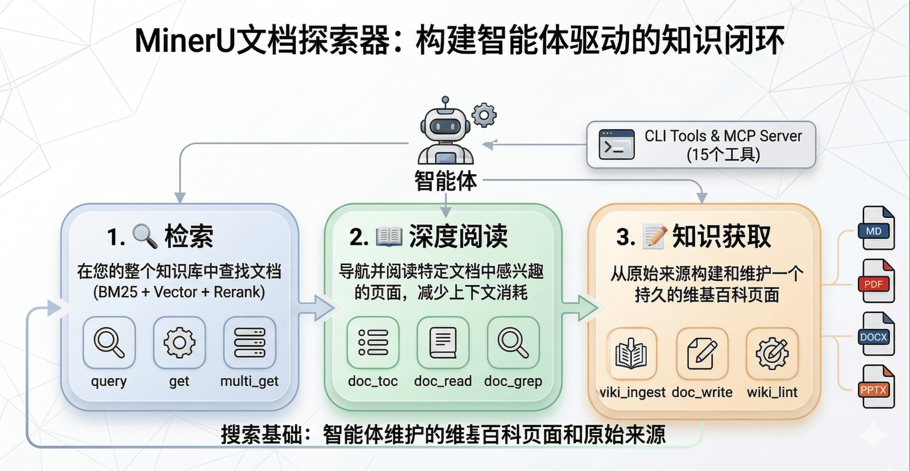
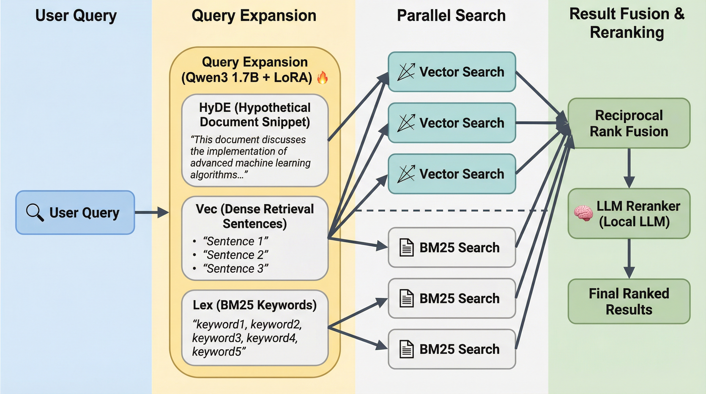

## MinerU Document Explorer 使用教程

> 目标：把你的 Markdown / PDF / DOCX / PPTX 变成 **“可搜索、可精读、可持续写入的知识库”**，让 AI Agent 能像人一样 **先找、再读、再回答，并留下可追溯的知识产物**。

**✨ GitHub**：https://github.com/opendatalab/MinerU-Document-Explorer

### 一张图理解：检索 → 精读 → 写回（知识闭环）



### MinerU文档探索器 的使用效果（来自 `demo/` 的真实产物）

运行 Demo 后，Agent 会把 10 篇论文整理成互相链接的 Wiki 知识库，并能继续在其上做检索与问答。

> 本文只给一条推荐路径：先跑 `demo/` 跑通闭环，再迁移到你的文档。  
> 其它分支统一放在文末“附录”供探索。

- **知识图谱（双向链接->关系网）**


- **概念页（跨文档综合：定义 + 相关文档 + 相关概念）**


- **文档摘要页（结构化总结 + 交叉引用）**


---

### Demo：我们如何用 MinerU 做到“自动阅读 + 自动写知识库”

`demo/` 的设计原则很明确：**脚本只做最少的非智能工作**，其余全部交给 Agent。

- **脚本（`demo/setup.sh`）只负责**
  - 从 arXiv 拉取论文（外部 API）
  - 建 collection 索引（把 PDF 变成可检索资产）
  - 可选：生成 embedding（让语义检索/文档内语义定位可用）

- **Agent（通过 MCP + Skill）负责**
  - `wiki_ingest` 返回“摄取上下文”（内容/TOC/相关页/建议），用于制定阅读/写入计划
  - `doc_toc` / `doc_read` 精读关键章节
  - `doc_write` 写论文页 / 概念页，并用 `[[wikilinks]]` 互相连接
  - `wiki_lint` / `wiki_index` 做质量检查与索引页生成

脚本只负责抓取与建索引，Agent 会通过 MCP 工具自主阅读论文并写出 Wiki 页面。

最小化安装配置：

```bash
# 如果你已经在仓库根目录，可跳过前两行
git clone https://github.com/opendatalab/MinerU-Document-Explorer.git
cd MinerU-Document-Explorer

# Python（文档处理必需）
python3 --version  # 需要 >= 3.10

# Node.js（运行 qmd CLI 所需；或使用 Bun 作为替代运行时）
node --version     # 需要 >= 22

# 安装/更新 qmd（后文默认使用 `qmd ...`）
# 任选其一：npm / pnpm / yarn（不需要 bun）
npm install -g mineru-document-explorer
# pnpm add -g mineru-document-explorer
# yarn global add mineru-document-explorer
# 或者（如果你已经装了 bun）
# bun add -g mineru-document-explorer
qmd --version
#
pip install feedparser pymupdf
bash demo/setup.sh --max 3 --skip-embed
```

> 注意：安装 `mineru-document-explorer` 时会安装 `node-llama-cpp`。如果你的系统/架构没有对应的预编译二进制包，可能会触发本地编译（postinstall），需要 **CMake + C/C++ 编译工具链**。
>
> - macOS：先运行 `xcode-select --install`，再 `brew install cmake`
> - Ubuntu/Debian：`sudo apt-get update && sudo apt-get install -y build-essential cmake`

然后把 Agent 接上 MCP（推荐：Claude Code）：

```bash
claude mcp add qmd -- qmd --index demo mcp
```

接下来，把下面这段“给 Agent 的最小指令”**直接复制粘贴**到你的 Agent 对话里（作为第一条消息即可）：

```text
你现在可以调用 MinerU Document Explorer（qmd）的 MCP 工具，并且我已经准备好了 demo 索引（index=demo）。

目标：阅读 sources collection 里的论文，并把阅读成果写进 wiki collection，形成可互相链接的 Wiki。

重要约束：
- 只使用 collection 相对路径（例如 sources/xxx.pdf、papers/xxx.md），不要使用本地绝对路径（/Users/...）。
- 读 PDF 先 doc_toc 再 doc_read；不要用 get 把全文倒出来。
- 写 Wiki 用 doc_write，并且每个页面都必须带 source="sources/xxx.pdf" 便于追溯。

最小交付（先完成这个闭环）：
- 为每篇论文写 1 个摘要页：papers/<paper-slug>.md
- 至少写 2 个概念页：concepts/<topic>.md（跨论文综合）
- 运行 wiki_lint 修断链/孤页
- 运行 wiki_index(write=true) 生成 index.md

开始请先执行 status() 验证 sources/wiki collection 存在，然后用 query 找到有哪些论文，再对每篇论文按 doc_toc → doc_read → doc_write 的顺序完成写入。
```

---

如果你只想体验 Demo，到这里就已经跑通闭环了。下面继续把它用到你自己的文档。

### 把它用到你的文档（5 分钟准备）

#### 运行环境

```bash
# Python（PDF/DOCX/PPTX 处理必需）
python3 --version  # 需要 >= 3.10

# Node.js（运行 qmd CLI 所需；或使用 Bun 作为替代运行时）
node --version     # 需要 >= 22

# Bun（可选：仅当你想从源码运行 / 走 bun 命令时需要）
bun --version      # 可选
```

#### 安装 Python 依赖（二进制文档处理）

```bash
pip install pymupdf python-docx python-pptx
python3 -c "import pymupdf; import docx; import pptx; print('OK')"
```

#### 命令入口

由于MinerU文档探索器基于QMD进行二次开发，本文所有 CLI 示例都统一使用 `qmd ...`。

### 第一步：把文档加入知识库（Collection）

Collection 是“文档集合”，所有检索与精读都以 collection 为单位组织。

```bash
# 索引一个混合格式文件夹（推荐）
qmd collection add ~/my-docs --name docs --mask '**/*.{md,pdf,docx,pptx}'

# 查看索引状态（集合、文档数、是否需要 embedding）
qmd status
```

为了让检索更“懂你的语境”，建议补充 context（会跟随搜索结果返回给 Agent）：

```bash
qmd context add qmd://docs "项目设计文档、接口规范、会议纪要与周报"
qmd context list
```

---

### 第二步：检索（从“找到文件”开始）

MinerU Document Explorer 有好几种“找东西”的方式。小白只要先记住两条就够了：

- **`search`**：像在文档里“搜关键词”（最快、零模型、零门槛）。
- **`query`**：像在资料库里“问问题”（更聪明、推荐）。第一次可能会下载/加载本地模型，之后会快很多。

```bash
# 先用关键词搜索快速验证是否通
qmd search "认证 模块 架构"

# 需要更“聪明”的问答式搜索时用 query（首次可能下载模型）
qmd query "认证模块的整体架构是什么？有哪些关键组件与数据流？"
```

#### BM25 vs 语义检索

- **`search`**：BM25 / Full-Text Search（精确词项：专有名词、报错、编号、代码 token）
- **语义向量检索**：同义/概念召回；可能引入“语义相关但不含关键事实”的噪声段落 → 用 `doc_read` 核对
- **`query`**：BM25 + 向量 + 重排（默认推荐）

Tips：精确术语用 `search`；不确定/概念问题用 `query`；单篇内定位优先 `doc_grep`；单篇内语义定位用 `doc_query`（需计算嵌入向量，见文末附录 D）。

**想看内部怎么拼：query 的检索管线（BM25 + Vector + Rerank）**


**进阶（可跳过）：我想更精确地控制搜索（lex/vec/hyde）**
当你发现“关键词太死板 / 语义太泛”，可以用结构化查询把意图拆开：

- `lex:` 关键词 + 精确短语 + 排除词
- `vec:` 用自然语言提问或匹配
- `hyde:` 你预期答案长什么样的一段话

---

### 第三步：精读（只读需要的段落，不整篇倾倒）

面对 PDF/DOCX/PPTX 或超长 Markdown，推荐固定套路：

1) `doc_toc` 先看结构 (自上而下)  
2) 再用 `doc_read` 按地址读取关键章节 
3) 自下而上找细节用 `doc_grep`（关键词/正则）或 `doc_query`（语义）

```bash
# 看目录 / 结构
qmd doc-toc "docs/spec.pdf"

# 按地址精读（PDF 用 page，Markdown 用 line，DOCX 用 section，PPTX 用 slide）
qmd doc-read "docs/spec.pdf" "page:3-5"

# 文档内关键词定位
qmd doc-grep "docs/spec.pdf" "token|jwt|session"
```

**地址（address）是精读的关键抽象**：`doc_toc` / `doc_grep` / `doc_query` 会返回地址字符串，把这些地址直接喂给 `doc_read` 即可。

---

### 第四步：把 Agent 接进来（推荐：Claude Code）

MCP 服务器把“检索 / 精读 / 写入”这些能力做成工具，让 Agent 能像调用函数一样读文档。

在 Claude Code 里添加一次 MCP 服务器（Claude 会自动启动并管理子进程）：

```bash
claude mcp add qmd -- qmd mcp
```

如果你要连接 Demo 索引（index=demo），直接用本文开头 Demo 小节那条命令（带 `--index demo`）。

其它客户端（Cursor/HTTP 模式等）放在文末“附录”，先别管。

---

### Skill：把“正确使用工具”的经验固化下来

工具解决“能做什么”，Skill 解决“怎么做得对、做得省 token、做得可追溯”。

仓库内置 Skill：`skills/mineru-document-explorer/SKILL.md`，它会教会 Agent：

- **只用 collection 相对路径**（例如 `docs/readme.md` 或 `#docid`），避免绝对路径。
- **大文档永远先 `doc_toc` 再 `doc_read`**，避免 `get` 倒出整篇文本。
- **用地址串联工具**：`doc_toc/doc_grep/doc_query` → 地址 → `doc_read`。
- **写 Wiki 必带 `source`**，用于可追溯与过期检测（`wiki_lint`）。
- **优先 MCP**：模型常驻内存/显存；CLI 每次调用都要重复加载模型，开销更大。

安装 Skill：

```bash
qmd skill install
```

---

### 典型“灵活问答”工作流（Agent 会怎么做）

下面用“工程文档问答”举例说明 Agent 的工具链：

```text
用户：认证模块的架构是什么？请求从哪里进，token 在哪里校验？失败怎么处理？

Agent（典型策略）：
1) status          → 确认有哪些 collection、是否已有 embedding
2) query           → 找到最相关的规格/设计文档
3) doc_toc         → 找到 “Architecture / Auth / Token / Error handling” 对应章节地址
4) doc_read        → 精读这些章节（只读关键页/段）
5) doc_grep        → 定位 “JWT / signature / refresh / 401 / 403” 等细节
6) 组织答案         → 每个结论给出来源段落（便于复核）
```

如果你希望“问答不止一次，而是持续积累”，就把结论写成 Wiki 页：

> 前提：你已经创建了一个可写入的 `wiki` collection（见文末附录 E）。

```text
doc_write(collection="wiki", path="concepts/authentication.md", content="...", source="docs/spec.pdf")
```

之后 Agent 再问同类问题，会优先命中你写过的 Wiki 页，实现“越用越好用”。

---

### 能力边界与常见问题（避免踩坑）

- **`doc_elements` 的现状**：
  - **DOCX/PPTX**：目前支持本地提取“表格”（返回 HTML）。
  - **PDF**：元素级提取需要额外云端配置，当前版本仍在完善中；对 PDF 的表格/公式信息，通常优先依赖 **MinerU 的高质量全文解析结果**来支撑问答与引用。

- **第一次 `query` 比较慢**：
  - 多数情况是首次下载/加载本地模型（embedding、重排序、查询扩展）。用 **MCP 常驻服务**可以避免每次 CLI 都重复加载。

- **提示没有 embedding / `doc_query` 没效果**：
  - 先跑 `qmd embed`（首次会下载模型，时间取决于网络与文档量），再使用 `query` / `doc_query`。

- **PDF/DOCX/PPTX 无法处理**：
  - 先检查 Python 与依赖包：

```bash
python3 --version
python3 -c "import pymupdf; import docx; import pptx; print('OK')"
```

---

### 下一步：把它变成你的“专属文档问答 Skill”

当你确定了团队的高频任务（例如“审合同”“读论文”“查项目规范”“写周报”），推荐把工作流写成一个领域 Skill：

- **输入**：用户问题 + 目标 collection（或路径范围）
- **过程**：`query` → `doc_toc/doc_grep/doc_query` → `doc_read` → 综合回答
- **输出**：答案 + 引用证据；必要时 `doc_write` 沉淀成 Wiki 页

你可以复用内置 Skill，并在其上加上“你们领域的提问模板、必读章节、证据格式要求、写入 Wiki 的结构约束”。

---

### 附录：更多路径（放到最后，可跳过）

下面这些都是“可选分支”。建议你先把正文的主流程跑通，再回来看。

#### 0）没有安装 `qmd`？（从源码运行的兜底）

如果你在仓库里跑 Demo、但还没把 `qmd` 安装到 PATH，可以先用下面任一方式：

```bash
# 方式 A：临时从源码运行（不需要 bun；把文中所有 `qmd ...` 替换成这一条）
npm install
npm run qmd -- ...

# 方式 A2：如果你更喜欢 bun，也可以用 bun 临时从源码运行
# bun install
# bun src/cli/qmd.ts ...

# 方式 B：安装/更新为全局命令（推荐；不需要 bun）
npm install -g mineru-document-explorer
qmd --version
```

#### A）不用 Claude Code：手动启动 MCP（stdio）

```bash
# 默认索引
qmd mcp

# Demo 索引（index=demo）
qmd --index demo mcp
```

#### B）Cursor / 多客户端共享：HTTP 模式

1) 启动 HTTP 服务（前台）：

```bash
# 默认索引
qmd mcp --http

# Demo 索引（index=demo）
qmd --index demo mcp --http
```

2) （可选）改成守护进程（后台常驻，默认端口 8181）：

```bash
qmd mcp --http --daemon
curl http://localhost:8181/health
qmd mcp stop
```

3) Cursor 配置（项目级 `.cursor/mcp.json`）：

```json
{
  "mcpServers": {
    "qmd": { "url": "http://localhost:8181/mcp" }
  }
}
```

#### C）启用 MinerU Cloud（高质量 PDF 解析，可选）

适用于扫描件、复杂排版、表格密集 PDF（证据质量更好）。

```bash
pip install mineru-open-sdk
export MINERU_API_KEY="your-key-here"  # 从 mineru.net 获取
```

设置 `MINERU_API_KEY` 后，索引 PDF 时会自动优先使用 MinerU Cloud（并以 PyMuPDF 作为兜底）。

#### D）生成向量 embedding（可选）

如果你希望 `query` / `doc_query` 更懂“同义表达 / 自然语言提问”，可以生成 embedding（一次性工作）：

```bash
qmd embed
```

首次运行会下载本地模型，耗时取决于网络与文档量。

#### E）创建一个可写入的 Wiki collection（可选）

如果你希望把“阅读后的结论”沉淀成可维护笔记，建议单独建一个 **wiki collection**（可写、可追溯），不要和原始文档混在一起：

```bash
mkdir -p ~/my-wiki
qmd collection add ~/my-wiki --name wiki --type wiki
qmd context add qmd://wiki "Wiki 知识库：由 Agent 编译生成的总结、概念页与索引页"
```

